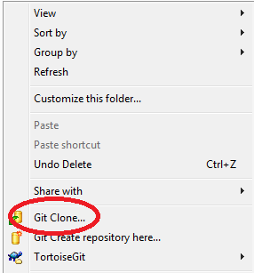
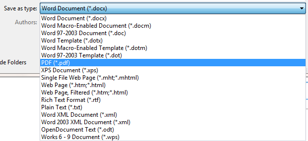
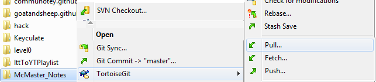
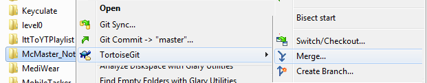
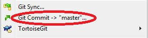

McMaster_Notes
==============

Here I will host course summary notes for the courses I am currently taking, as a McMaster Software Engineering student, until each course has finished, when they'll be uploaded to the main website. Since they are frequently updated, it is easier to put them here than repetitively update the versions on [my main website](https://sites.google.com/site/macengfifteen/). 

If you simply wish to view the notes, open the PDF files (vs `.doc`) to reduce potential compatability issues when viewing the Math objects.

##Downloading the files

1. Download [TortoiseGit](https://code.google.com/p/tortoisegit/wiki/Download?tm=2).
2. Make a folder in `Documents` called `git`.
3. Right-click the folder and hit `Git Clone`. 

##Making Changes

1. [Make a GitHub account](https://github.com/join).
2. [E-mail me](mailto:goatandsheep@gmail.com?subject=Add%20me%20to%20the%20McMaster%20Notes%20Github%20pl0x) to ask me to give you collaborator status.
3. [Learn how to use Markdown](http://markdowntutorial.com/), the formatting language for most of the documents.
4. If the file is a Microsoft Word file:
 1. Save the file.
 2. Re-save the file as a PDF in Microsoft Word 
5. If the file is a markdown file (`*.md`), edit it using any text editor and it will work. 
6. Right-Click the `git/McMaster_Notes` folder.
7. Press `Fetch...` to get changes (in case someone else has changed stuff): 
8. Right-Click the folder again
9. Press `Merge...` to merge their changes with yours. 
10.  Right-Click the folder again.
11.  Press `Git commit -> "master"...` to package your changes. 
12.  Right-Click the folder again.
13.  Press `Push...` to upload changes. 
14.  Just keep pressing `Ok`.
15.  It will ask you for your GitHub email address and password.

If you need to input an equation, I want to make it as easy as possible, so you may attach it and I will convert it to MathType afterwards. As long as the equation is clear. For example, you could include:

* a link to a formula
* a page in a book
* MathType (optimal)
* scan of the equation on paper
* more

Sincerely,

goatandsheep
