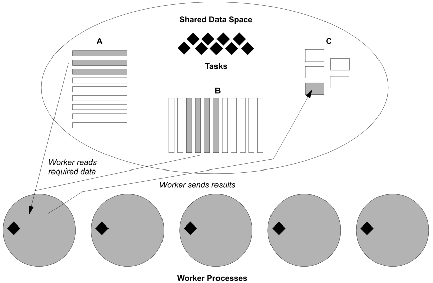

SFWR ENG 3BB4 Summary
=====================

* Dr. Maibaum
* *Winter 2015*
* McMaster University
* *Primary Author*: Kemal Ahmed

-----------------------------------

This course is about concurrency in systems.

[TOC]

**Concurrent Software**: 

**Distributed Software**:

We represent models of concurrency using finite state machines (a.k.a. FSP).

Threads
-------
: *<ins>active</ins> entities because they initiate actions*

> Opposite of [monitors](#monitors)

**Sequential process**:

**Processes**: units of sequential execution

<ins>Models of Processes:</ins>

* **Finite State Processes (FSP)**: model processes as sequence of actions in an <ins>algebraic form</ins>
* **Labelled Transition Systems (LTS)**: analyzes, displays, animates behaviour in a <ins>graphical form</ins>

**Labelled Transition Systems Animator (LTSA)**: a cool program

<ins>FSPs follow algebraic rules, such as:</ins>

* Associativity: order of which operations to perform is sometimes irrelevant
* Communitivity: `x || y = y || x`
* Associativity: `x || (y || z) = (x || y) || z = (x || z) ||y`

<ins>State Machine Details:</ins>

* Colour coding is sometimes used
 * Blue generally defines arbitrary states
 * Red generally defines the first state
* An arrow without a head is still the standard for the beginning state, like from [2FA3](https://docs.google.com/document/d/12b0YsgYtB3cnhiu39eKqpl6b2guSE04wUk4Gg8G9nt4/edit)
* Arrow is triggered by a condition and 

**Trace**: a possible sequence of actions; there can be multiple traces for a given FSM

**Maximal trace**: 

**Action** [x]:

**Process** [P]: processes are ALWAYS CAPITALIZED

`(x -> P)`: a representation of a *process*, engaged by an action, x, and does the process, P

###e.g.

	SWITCH = OFF  
	OFF = (on -> ON),  
	ON = (off -> OFF).
	
	SWITCH = OFF,
	OFF = (on -> (off -> OFF)).
	
	SWITCH = (on -> off -> SWITCH).

One rule of precedence that allows you to remove brackets is that you execute from Right to Left

`(x -> P | y -> Q)`: engages in either the first or second action, depending on the input that selects it

**Concurrency**: 

**Parallelism**: 

*Are there shared actions?*

**Labels**: (`label:Process` | e.g. `a:P`)

**Prefix Labels**: useful for modelling shared resources (`{set of prefix labels}::Process` | e.g. `{a1,..,ax}::P`)

*When you're implementing a parallel database, you need to make sure that you don't do half the re-saving/editing processes before you allow someone else to open the file.*

**Equivalent**: same trace

####Action hiding

`P = (C -juice-> J,`
	J -return-> P ) \{return}

this hides the return function

##Shared Objects
: *How do you allocate access to a resource among multiple processes?*

**Mutual Exclusion**: when only one process can access a resource at a time

###Semaphor
: *Something that enables access to a resource*
> You can implement a *handshake* using multiple semaphors that allows you to toggle execution when sharing a resource

**Race Conditions**: the process that gets to the resource the fastest goes first

If you have multiple processes that need to be executed from a given processor that are waiting to be executed on a shared resource, you can push the processes onto a stack and wait, until the resource is free. Using this in conjunction with the semaphores will be nice.

Semaphors also count the number of processes waiting to use the resource

When a resource is unavailable, the process can either wait or do a non-critical process.

**Binary Semaphor**: enables and disables?? 

##LTSA
: *Labelled Transition System Analyser*

`ERROR`: predefined process to identify...error

`acquire`

`release`

**livelock**: when processes are waiting for a process to stop using a resource that they are locked into using

####Synchronized

`synchronized`:

`synchronized <object>`: only one person can access a method at a time

Monitors
----------

> *<ins>passive</ins> entities which respond to actions (a.k.a. humans)*

* Opposite of a [thread](#threads)
* The early conception of an object
* Can be implemented in object-oriented languages, where its use makes it a *monitor*

**Guarded Actions**: modelling by defining the range of the system monitors, identified by `when`

* `wait()`: sleeps thread, until notification from another thread
* `notify()`: only runs one thread
* `notifyAll()`: wakes up all waiting threads and the ones that don't get access get put to sleep
	* overkill, so use `notify()` if you know you only have one thread
	* operating system deals with the order in which threads are executed 

Interference
------------

> Interactions between processes trying to share a resource.

* It can be good
* Controlled by [monitors](#monitors)

**Feature interaction**: unwanted interference

###Bounded Buffer

> A process queue for when there are multiple resources

##Deadlock
: *When multiple processes need multiple resources simultaneously to continue but it's not working*

> **Think** if there is one chopstick on the left and one on the right of each person on a table, but you need 2 and everyone takes the right chopstick, nobody can eat because you need 2
 
###Safety & Liveness property

**Termination**: every program should end

**Liveness**: 

###Progress Properties

**High Priority** [<<]:

**Low Priority** [>>]:  

Dynamic Systems
---------------

You can only model these with a static version of these with specific parameters.

synchronous: 

asynchronous: 

Rendezvous: bidirectional

**Filters**: process that transforms a stream of inputs into a stream of outputs

**Connectors**: (a.k.a. *pipes*) define interaction between components in the architecture

Linda
-----

**Linda Model**: a method of parallel execution that works like a messy table (shared tuple space) of tasks / resources (tuples), where workers can take tasks any in any order and it won't mess up the program execution. If you have operations that need to go after, you would put them in a later tuple.

 `("tag", expr1,...,exprn)`

**Process tuples**: (a.k.a. *live tuples*)

**Data tuples**: (a.k.a. *passive tuples*) `("tag", )`

**Blocking** if there are no matches, the program will wait until there is a match

**Nonblocking**: returns false if no matches

Operations:

* `in(template)` (<ins>blocking</ins>): removes a tuple from tuple space
	* <ins>Nonblocking</ins> version: `inp`
* `rd(template)` (<ins>blocking</ins>): reads the values in a tuple in tuple space without affecting it 
	* <ins>Nonblocking</ins> version: `rdp`
* `out(data tuple)`: inserts a data tuple in tuple space
* `eval(process tuple)`: creates a process tuple

###Templates

> (a.k.a. *anti-tuple*) a way of querying for tuples that follow a certain template

* can contain **actuals**, values that aren't placeholders
* contain placeholders, called **formals**, denoted by `?variable_name`
* e.g. if you're looking for `("cube", 8, 512)`
	* `rd("cube", 8, ?i);` will assign 512 to `i`
	* `in("cube", j, ?i);` would only remove this particular tuple if `j=8`
* A template matches a tuple when:
	* They both have the same number of fields
	* The types, values, and length of all *actuals* in the template are the same as the those of the corresponding fields in the tuple
	* The types and lengths of all *formals* in the template match the types and lengths of the corresponding fields in the tuple.
* When a matching tuple is found, then the variable *i* will be assigned the value in the second field of the matched tuple

###Tuple Space Model

* An visual representation of the [Linda model](#Linda).
* Tuples are represented as `tag.val1.val2...valn`

Timed Systems
-------------

**Timed Systems**: Programs that are concerned with the passage of time and synchronize processes through a global clock.

In order to model Times Systems/Programs we use a representation of time which is signaled by successive 'ticks' of a clock.

Deadlock may happen in timed systems due to a 'time-stop'; where due to a tick inconsistency between processes, the model of the program cannot progress time any further (the next tick is deadlocked). To fix such a deadlock condition in a timed system, one can make the tick action a "low priority" action (SYS>>{tick}) and make the tick action a progress (progress TIME = {tick}) to ensure progression of time.

Implementation of Timed Systems

**Thread-based approach**: Uses sleep() and wait() functions to synchronize with time

**Event-based approach**: Uses 'tick' actions instead to broadcast timed events to other entities that need to be aware of passage of time.

Any entity with the action 'tick' in its alphabet becomes a timed object in implementation.

Broadcasting of timed events is taken care of by the TimeManager thread.

**Parcel Router**:
 
 

The problem... "Parcels are dropped in a chute and fall by gravity; each parcel has a destination code, which can be read so that the parcel is routed to the correct destination bin. A switch can only be moved if there is no parcel in its way."

There are 6 processes to take into account when addressing the Parcel Router Problem:

**GEN**: Generates a parcel every T units of time.

**BIN**: Contains information about the destination number it contains and that of the parcels destination.

**STAGE**: Defines the different stages which every parcel must go through.

**CHUTE**: Models movement of a single parcel through a segment of a physical chute.

**SENSORCONTROLLER**: Detects a parcel by observing the action caused by a parcel passing from one CHUTE to the next. It computes the SWITCH process state by observing the parcel destination.

**SWITCH**: Can be derived from the CHUTE implementation. Ignores SENSORCONTROLLER commands while parcel is going through.