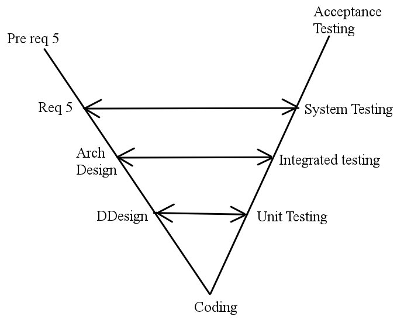

SFWR ENG 3S03 Summary
=====================

* Teacher: Dr. Khedri
* *Winter 2015*
* McMaster University
* *Primary Author*: Kemal Ahmed

-----------------------------------



Challenges of Software Testing
-----------------------------------

* Budget pressure
 * Project planner underestimates costs of a stage
 * Estimated budget was never approved
 * Safety is required before features 
* Time pressure
 * Lower time pressure with more developers
 * Can happen if there are too many delaying factors
* Managing testing
 * Those who do testing need to be qualified
 * How to test?
     * What?
     * When?
     * How much resources?
 * Ambiguous Requirements, documentation, etc.
 * More environments
 * More languages
 * More layers

Measurement
-----------------------------------

**Metric**: a quantitative attribute 

**Measurement**:

**Benchmark**: a standard unit of measurement 

**Measure**: to determine the measurements of something

**Symbol**: a short representation of a unit of measurement

###What to measure?

Measure everything useful to achieving your goals.

Sometimes, it can be difficult to describe an attribute using a metric, e.g. colour in nanometres.

Sometimes you want to measure something that is a combination of attributes.

###Types of measurements

**Deductive**: directly measured 

**Inductive**: determined by putting different deduced information together

Models for testing
-----------------------------------

Often, it's not enough to simply say whether something is good or bad, so we define a model that scores it using a combination of metrics that give a quantitative score. That includes:

* Quality of Requirements
* Management issues
* Quality of work
* Productivity
* Cost
 * **Effort**: 
 * **Size**: lines of codes & function points
 * **Productivity**: 
* etc.

product: physical entity, e.g. 
process: observable at run-time, e.g. complexity
resource: hr stuff, manpower, e.g. productivity

Models demonstrate:

1. Things whose effects are neglected
2. Things that affect that model that you didn't consider.
3. Things that you did consider

**Gib's Fuzzy Testing**: 

<ins>Khedri's words of wisdom</ins>: when the company at your internship is doing stuff in a non-systematic way, do what you can to change it.

**COnstructive COst MOdel (COCOMO)**:

------------------

```sequence
A->B: h^{nf}
A->B: h
```

$A=(A,F,R)$

$h^{m_R}$ is a subset of P

`(S,F,R)`

A structure is **algebraic** iff $R=0$
`(S,F)`

A structure is **relational** iff $F=0$
`(S,R)`

####e.g. Graphs

$$G = (V,E)
=( \{a,b,c,d\},\{a,d\},\{b,c\},\{a,b\},\{d,c\},)$$

A = V
F = 0
$R = \{E\}$

$h \left ( f\left ( a_1,...,a_{n_y} \right ) \right ) = g \left (h^{n_f} \left ( a_1,..., a_{n_y} \right ) \right )$

####Surjective
: *Nothing goes unmapped*
> * Not [injective](#injective)
> * Could be a <ins>measurement mapping</ins>


####Injective
: *No overlap*
> Not [surjective](#surjective)


####Bijection
: *A function + injective + surjective*
> Every definition is reached once


###Evaluating software

####Likert Scale
: A reliability scale of software where someone selects agreement from a set of {`strongly agree`, `agree`, `neither`, `disagree`, `strongly disagree`}

####Forced Ranking
: Rank the options from 1 (best) to *n* (worst).

####Verbal Frequency
: Select failure frequency from the set of {`Always`, `Often`, `Sometimes`, `Seldom`, `Never`}.

####Comparative Scale
: Pick integer from 1---*n* from `Superior` to `Inferior`

####Numerical Scale
: Pick integer from 1---*n* from `Unimportant` to `Important`

####Statement Type
: blah

###More...

####Homomorphism
: A **homomorphism** or **representation** is a mapping from $A$ to $B$ that preserves the operations of $A$ to the corresponding in $B$. It also weakly preserves the relations in $A$ to their corresponding in $B$.
> i.e. a structure from $A$ to $B$ that satisfies rule 2 (function) and 3 (relation).
> $$h: A  \rightarrow  B$$

: An application of this concept is described in a book called [*Calculus is Algebra* by William Hatcher](https://www.jstor.org/stable/pdfplus/2321645.pdf?acceptTC=true).

The connection between the real $(S, F, R)$ and mathematical worlds $\mathbb{R}_R, F_R, R_R$, using empirical analysis, $\mu_1$.


####McCabe Threshold

$\eta$ measures:

* fault-prone
* maintainability
* Range: 0-10

####Direct Measurement
> ga

####Reliability Model

$$F(t) = 1 - e^{-\left (N - i + 1 \right )at}$$

###Measurement Scales

Scale = (, mapping)

**Algebraic Difference Structure**: 

**Admissible transformation**: allows you to move from scale-to-scale when the attributes and scale are the same

* integral scale: $g(x) = \alpha\mu(x) + p$
* Ratio scale: $g(x) = \alpha\mu(x)$
* ordinal scale: strictly monotonic scale
* nominal: one-to-one mapping

**Halstead**: 

##Concatenating Scales

####Nominal
* <ins>no order</ins>
* pick from set of categorized responses
* e.g. gender, colour, religion, etc.

####Ordinal
* <ins>ordered</ins>
* non-linear scale
* Arbitrary distance between values
* e.g. satisfaction from 1-4
	* Difference between 1-2 ≠ diff 3-4

####Interval
* ordered
* <ins>linear scale</ins>
* arbitrary zero value

####Ratio
* ordered
* linear scale
* <ins>zero identifies absence</ins>

####Absolute
* ordered
* linear scale
* zero identifies absence
* <ins>cannot be negative</ins>

##Empirical Scale
: *derived through experimentation and observation, not theory*

Analyzing the difference between reality and mathematical scales

1. Define your empirical relation. It could be any symbol you want. `>>`, `+`, `o`, etc.

$sc = $ 

##Other Stuff again

**Quotient Structure**: MyHill-

MCC**:

**BSEQ**:

**BALT**:

**RSEQ**: $\text(RSEQ)(R_1, R_2) = $

$\mu (x) = \frac{1}{\mu'(x)}$

Writing a Testing Plan
-----------------------------------

* Make sure you don't use illegal software
* If it's free, there's probably a license associated with it, so read that license.
* Implied warranty
* Be specific of inputs

**Meaningful transformation**:  

###Parts

1. **Specifications**: correct input and output, i.e. pre- & post-conditions
2. **Methods & Constraints**: 
3. **Methodology**: 
4. **Test tools**
5. **Extent**: how much of the code and why
6. **Data Recording**: 
7. **Constraints**: 
8. **Evaluation**: 

###Project Management

* Unit description
* Milestones (a.k.a. dates)
* Budget
* Test approach
* Functions not tested
* Test constraints

###Principles

* *Developers should avoid testing their own programs (still debug, tho)*: dev's perspective is different from users' perspective
* *Organizations should avoid testing their own programs*: people have stresses like time that makes people within an organization accept certain mistakes

Testing
: Finding the errors in a program, **NOT** proving its correctness

Fault Seeding
: Predicting where your program will fail

Ideal test set
----------------
> A set that shows an error wherever there is an error

[P is correct OR $\exists$ (d | e T : P is incorrect for d)] ⇒ T is ideal

[P is NOT correct AND $\forall$ ...

###Criterion

For a correct program, <ins>any test set is ideal</ins>.

**Statement Coverage**: tries all true conditions, minimizes test conditions

**Edge cases**: tries around conditions as to break the system

**Path Coverage**: (a.k.a. branch coverage) testing edge cases

##Testing

###Extent

**Partial Testing**: not testing in every possible domain of inputs

**Total Testing**: testing in every possible domain of inputs

###Types

**Functional testing**: does the program follow the requirements

**Stress Testing**: testing the boundaries of the program, i.e. can systems function under large volumes of inputs. This can also be done by exposing systems to inputs for long periods of time 

**Execution Testing**: performance testing in terms of speed

**Recovery Testing**: ability to continue after integrity of system is compromised. Revert to a point where the integrity of the system is known and reprocess.

**Operations Testing**: completion of documentation, training, etc.

**Compliance Testing**: complies to standards, procedures, and guidelines

**Security Testing**: ensuring confidentiality and integrity of private information

##JUnit

What:
An open source Java testing framework to automate testing

I'm using NetBeans

For each class you want to test:

1. Open the class / bring it into view
2. `Tools` > `Create/Update Tests`: Select the latest JUnit edition and use default settings. This will generate a test file.
3. Scroll down to the function in that test file with `@Test` above it.
4. The other four functions:
	1. `@BeforeClass`: at the beginning of the test cycle, i.e. all the tests
	2. `@Before`: at the beginning of each test
		1. Maybe you'll want to initialize stuff
	3. `@After`: at the end of each test
		1. Maybe you'll want to reset values between tests
	4. `@AfterClass`: at the end of the test cycle
5. You'll notice that each test function will have a `fail` command by default. That is just to make sure you edit the function. Remove it.
6. Put the paramaters of your test and expected output into the variables and press `Run` > `Run File`.
7. If you want to make another test, copy and paste the test function, change the name of the function, and put different values in the variables, i.e. none of the method names matter.

You may want to organize your test file. The convention for comments is using a pound symbol `#`. You also have to manually add something that ignores the comments.

	if (line.startsWith("#")){ //Ignore comments
		continue;
	}

##Security

> Some suggestions on where people usually break systems

I don't know if this information will even be recent...