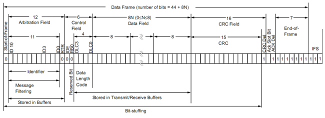
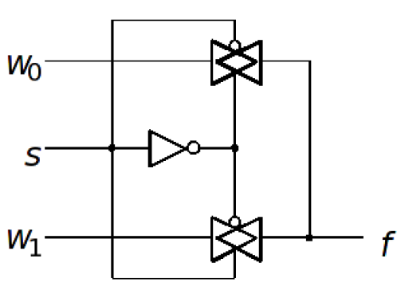
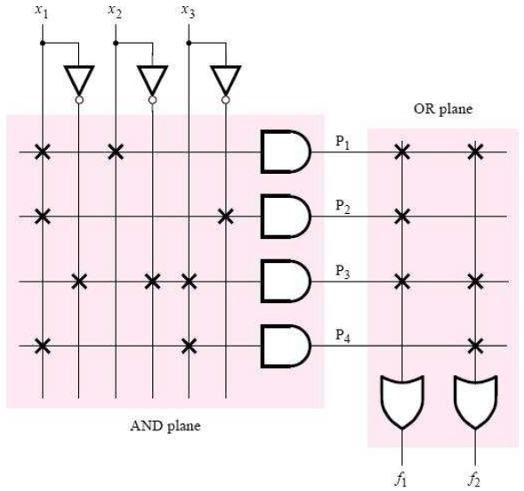

TRON 3TB4 Summary
=================

* Instructor: Dr. Lawford 
* *Winter 2015*
* McMaster University
* *Primary Author*: Kemal Ahmed
> Written with [StackEdit](https://stackedit.io/).

##CanBUS

> Controller Area Network

* 2-wire protocol: `CAN_H` and `CAN_L` that allows microcontrollers and devices to communicate without a host computer
* uses <ins>constructive arbitration</ins> (a.k.a. non-destructive)
	*  Since 2 wires travel the same length, they experience the same external noise, so you can just remove the noise 
* When both lines have same voltage, signal is *recessive*
* If `CAN_H` - `CAN_L` > 0.9V, signal is *dominant*
* No ground reference, i.e. no ground noise
* Maximum transmission rate: 1 Megabit / s
* Each device has its own priority
  * If the controller is busy when a signal has been sent to it, it will be delayed until it has the highest priority
* **Cyclic Redundancy Check (CRC)**: error detection of whether you got the right signal. There are multiple methods:
	* send the same message back and forth a couple times
	* *Hash*: mod the first half and the second half and send them together, do the same to the message when it has been received
* **Remote Transmission Request (RTR)**: are you sending data? sending: 0, no: 1



CAN uses non-destructive bitwise [arbitration](#arbitration)

Each CANBUS Node has:

* **Host processor**: generates messages to be sent; deciphers received messages
* **CAN Controller**: takes messages from host and transmits them to the bus
* **Transceiver**:


##Bit Stuffing
> Inserting extra non-data bits into data signals. The extra bits are removed upon being received.
 
This is useful for:

* increasing bit rates when they're too slow
* Preventing information from being interpreted as control information
	* For example, in X.25 protocol, 6 ones parses each message, so if the actual message has 6 ones, stuff a 0 after the 5th 1


####RZ
> **Return to Zero mode**:
> Pulses will always return to 0 even if there are consecutive pulses. 

The signal is bit-stuffed with 0's


####NRZ
> **Non-Return to Zero mode**:
> Pulses will never return to 0

The signal is bit-stuffed to keep its value, until the next pulse. If there are too many consecutive 1s, clock synchronization can be lost, so maximum of 5 1s in a row.


###Manchester Coding
> A.K.A. **Phase encoding**

**Biphase Manchester**:

##Dominant and Recessive Signals

If you have multiple signals, the **dominant** signal will change everything and the **recessive** signal won't.

> **Think**
> : *What will be the output when both values are prevalent?* A good example when trying to conceptualize this is an `AND` gate. When one signal is `0` and the other is `1`, what will...*dominate*? The `0`.
> 
> : This can be extended to when you have multiple devices in series with the same power usage...won't change voltage 

---------------------

**Ethernet** uses <ins>destructive conflict resolution</ins> / destructive bitwise [arbitration](#arbitration).

**Prototols**: how to interpret/represent a set of inputs

**Slew Rate**: rate of change of voltage / s; how jagged are your square waves?

**Baud Rate**: number of signals; 1/period; clock frequency / L * P, L = length of signal = sync bit (i.e. 1) + segment1 + segment2, P = Prescaler

**Differential BUS**: when 2 wires travel along the same path, they experience the same external interference. To determine the message, you need to find the difference between the 2 wires, so you actually end up subtracting out the interference

###Arbitration
: *What will happen when you try to send multiple signals along the same wire?*

* **Non-destructive**: the smallest one will go first(i.e. 1011 before 1100), well...think dominant, not smaller
* **Destructive**: no messages will be transmitted, so you need to retry a random number of times until you get it right

**Start Of Message (SOM) Bit**: generally `0`

###Polling 

* **Normal mode**: 
* **Loopback mode**: sends TX from controller to RX; don't need acknowledgements
* **Silent mode**: sends RX to TX; more checking if messages are spam
* **Silent-loopback mode**: 

----

Message filtering:

* Software
* Hardware

**Shannon Capacity**:

**ElectroMagnetic Interference (EMI)**:



##Verilog

###Keywords

`default`: catch-all for when none of the conditions are satisfied

####Initial Block
: Executed only once, providing initial values for system

####Always Block
: A block wired non-sequentially
> * Infinitely repeated concurrently
> * Can only have one always block
> * Assignments can only be done to registers
> * Last statement has the highest <ins>priority</ins>

What is meant by priority:

	x = 0
	x = 4
	x = 3
	print x
	 3

**Sequential block**: blocking, one thing at a time
**Combinational Logic**: only dependant on the logic

####Blocking assignment
: A block of code where statements *block* the execution of the following statement(s)
> First statement must complete before the second statement
> Identify in this format:
	> ```
	> begin
	> <statements>;
	> end
	> ```

####Number Representation

`<number of bits>b<value with minimal prior 0s>`

> e.g.
> `8b1`: 00000001

##Wiring Diagrams

* Intermediate wires are given arbitrary names
* The number of bits transmitted on each wire is labelled on each wire

##Asynchronous Systems
> A system that does not reset depending on the clock

**Posedge**: 1 marks the beginning of a high signal

**Negedge**: 1 marks the beginning of a low signal

**Minterms**: use Sum of Products when the output is 1; 1 is pos, 0 is neg

**Maxterms**: use Product of Sums when the output is 0; 0 is pos, 1 is neg 

###Boolean Algebra Axioms

1. $0\cdot0 = 0$
	1. 1+1 = 1
2. $1\cdot1 = 1$
	1. 0+0 = 0
3. $0\cdot1 = 1\cdot0 = 0$
	1. 1+0 = 0 + 1 = 1
3. If x = 0, then $\bar{x} = 1$
	1. If x = 1, then $\bar{x} = 0$
5. $x \cdot 0 = 0$
	1. x + 1 = 1
6. $x \cdot 1 = x$
	1. x + 0 = x
7. $x \cdot x = x$
	1. x + x = x
8. $x \cdot \bar{x} = 0$
	1. $x + \bar{x} = 1$
9. $\bar{\bar{x}} = x$

##Timing Diagrams

###Hints

* Make sure you put a small delay

##FPD
: *Field Programmable Device*

**Standard Chip**: inefficient

###PLD
: *A Programable Logic Device is a collection of programmable switches and general structures*

e.g. EEPROM, PAL, PLA, CPLD, FPGA



$f_1 = x_1x_2 + x_1\bar{x}_3 + \bar{x}_1\bar{x}_2x_3$
$f_2 = x_1x_2 + \bar{x}_1\bar{x}_2x_3 + x_1x_3$

LUT chart

Put 

####Macrocell
: *Extra circuitry after PAL and PLA circuits*

####CPLDs
: *Complex Programmable Logic Device is several PAL / PLAs in series*

####FPGA
: *Field Programmable Gate Arrays can be re-programmed after they've been deployed*

1. Calculate result and save
2. Use inputs to select the result from table

Changing the clock frequency

$t_{cq}$

$t_h$

$t_{su}$
